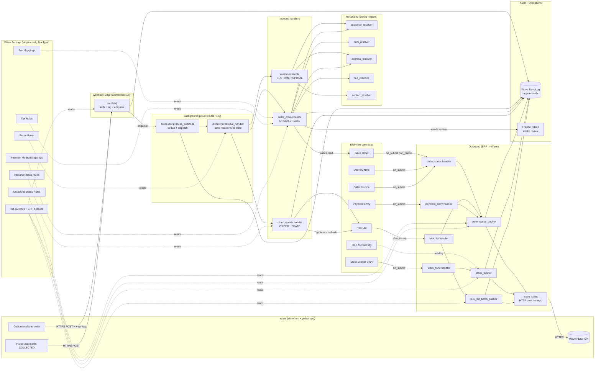

# Wave Sync Hypa — Instructions Manual & Architecture

This document is the single-source explanation of what this app does, how
it does it, and what every knob in **Wave Settings** controls. It is
written for a non-technical reader: an operations manager, an accountant,
a warehouse lead, or a brand-new engineer being onboarded to the codebase.

If you have never opened the codebase before, read top-to-bottom. If you
already know it and just want the settings reference, jump to
[The Wave Settings Page](#the-wave-settings-page-every-knob-explained).

---

## 1. What this app does, in one paragraph

Wave Sync Hypa is the bridge between **Wave** (the storefront / picker
app customers and shoppers use) and **ERPNext** (the back-office system
that holds inventory, accounting, and fulfilment records). When a
customer places an order on Wave, this app receives a webhook, looks up
the customer, looks up each product, and creates a draft **Sales Order**
in ERPNext. Then, as warehouse staff and accountants move that order
through the normal ERPNext lifecycle — picking, delivering, invoicing,
collecting payment — this app pushes the matching status back to Wave so
the customer always sees the right state on their phone. It also keeps
**stock balances** in sync the other way: when ERPNext records a stock
movement, the new on-hand quantity is pushed to Wave so the storefront
never sells what isn't on the shelf. And for **offline orders** that
originate in ERP — walk-in, phone, manual — an operator can click a
"Push to Wave" button on the Sales Order form, which creates a matching
order on Wave so it joins the same picker-app workflow as
Wave-originated orders.

That's it. Everything else in this document is detail on top of those
three sentences.

---

## 2. The two parties and the things they exchange

```
┌───────────────────────┐                            ┌───────────────────────┐
│        WAVE           │                            │       ERPNEXT         │
│  (storefront + app)   │                            │ (back office / wms)   │
│                       │                            │                       │
│  - Customers          │ ─── webhook (HTTPS) ────►  │  - Sales Order        │
│  - Products / SKUs    │     ORDER.CREATE           │  - Customer           │
│  - Orders             │     ORDER.UPDATE           │  - Item / Bin         │
│  - Picker app         │     CUSTOMER.UPDATE        │  - Pick List          │
│                       │                            │  - Delivery Note      │
│                       │ ◄── REST API (HTTPS) ───   │  - Sales Invoice      │
│                       │     stock sync             │  - Payment Entry      │
│                       │     order status           │                       │
│                       │     pick batch IDs         │                       │
│                       │     stock caps              │                       │
│                       │                            │                       │
│                       │ ◄── REST API (HTTPS) ───   │                       │
│                       │     ERP → Wave order push  │                       │
│                       │     (operator-triggered)   │                       │
└───────────────────────┘                            └───────────────────────┘
```

**Wave talks to us with webhooks** (Wave pushes us small JSON messages).
We talk back **using Wave's REST API** (we make HTTPS calls to their
servers) on two distinct channels: automatic event-driven pushes (stock
sync, order status, pick batch IDs, stock caps) and operator-triggered
ERP → Wave order pushes (the "Push to Wave" button on offline Sales
Orders). All three are gated by separate kill-switches in
[Wave Settings](#the-wave-settings-page-every-knob-explained), so
operators can shut off any channel without taking the whole integration
down.

---

## 3. End-to-end picture (the architectural diagram)

The diagram below uses Mermaid; GitHub renders it natively. If your
viewer doesn't, an ASCII version follows it.



### ASCII fallback (same flow, simplified)

```
   Wave ──webhook──►  webhook.receive()  ──enqueue──►  Background worker
                          │
                          │ (every step writes to Wave Sync Log)
                          ▼
                     processor.process_webhook
                          │
                          ▼
                     dispatcher.resolve_handler ◄── Wave Settings.route_rules
                          │
            ┌─────────────┼─────────────┐
            ▼             ▼             ▼
       customer       order_create   order_update
       handler        handler        handler
            │             │             │
            ▼             ▼             ▼
       Customer      Sales Order     Pick List
       + Contact     (draft)         (reconcile + submit)
       + Address       │
                       ▼
     ─ ERP staff work the doc through its lifecycle ─
                       │
       Sales Order → Pick List → Delivery Note → Sales Invoice → Payment Entry
                       │             │              │              │
                       └─────────────┴──────────────┴──────────────┘
                                          │
                                          ▼
                              order_status hooks (each ERP submit)
                                          │
                                          ▼
                              order_status_pusher (background worker)
                                          │
                                          ▼
                              wave_client.post_order_status
                                          │
                                          ▼
                                       Wave API

   Stock side (parallel channel):

       Stock Ledger Entry submit ──► stock_sync handler ──► stock_pusher ──► Wave
                                          (per-item job, deduplicated)
```

---

## 4. The three end-to-end stories

### 4.1 The inbound story — customer places an order on Wave

This is the path the user asked about: from the moment a customer taps
"checkout" in Wave through to a fulfilled, paid, closed ERPNext order.
Twelve stages; each one corresponds to specific code in this repo.

| # | Stage | What you'd see in ERPNext | What the code is doing |
|---|-------|---------------------------|------------------------|
| 1 | Customer checks out on Wave | nothing yet | Wave decides to send a webhook |
| 2 | Webhook hits us | a new row in **Wave Sync Log** with step `Received` | `api/webhook.py::receive` authenticates the `x-api-key` header, logs the body, enqueues a background job, and returns 200 instantly so Wave doesn't retry |
| 3 | Background worker picks it up | rows with steps `Enqueued`, `Processing` | `services/processor.py::process_webhook` runs; checks for duplicates (same Wave id + `updatedAt`); looks up which handler should run by consulting the **Route Rules** table on Wave Settings |
| 4 | Customer is resolved (or created) | possibly a new **Customer** + **Contact** + **Address** record | `handlers/order_create.py` calls `customer_resolver`; finds the existing ERP customer by `wave_customer_id`, optionally falls back to email match (if the toggle is on), or creates a fresh one. Guests route to the configured **Walk-in Customer**. |
| 5 | Each SKU is resolved | line items appear on the draft SO | `item_resolver` looks up each Wave SKU in ERP's Item master. **ERP is the source of truth for the catalogue** — if the SKU is missing the line is skipped, the SO is flagged for manual review, and a Comment is added explaining what to fix |
| 6 | Each fee is added as a line | extra lines like "Shipping Cost" appear | `fee_resolver` reads the **Fee Mappings** table; each Wave fee type maps to one ERP Item. The shipping line's rate is back-calculated from Wave's amount so the line total exactly matches what the customer paid — see [Shipping Item Tax Template](#shipping-item-tax-template) below |
| 7 | Tax + payment metadata stamped | the SO carries a **Sales Taxes and Charges Template**, plus `wave_payment_*` fields (type, status, gateway, classification, hold) | The first enabled **Tax Rule** stamps the tax template; the matching **Payment Method Mapping** classifies the order as `prepaid` or `cod` |
| 8 | Draft Sales Order saved | new SO appears with name like `SAL-ORD-2026-00123` and `wave_order_id` set | `_persist_sales_order` inserts the doc; ToDos are fired if anything went sideways (unresolved items, missing fee mappings, bad tax template) |
| 9 | Warehouse picks the order | a Pick List is created → `after_insert` fires → an `ACCEPTED` status is pushed to Wave (per the Outbound Status Rules), and (optionally) the batch numbers are PATCHed to Wave's order | `handlers/pick_list.py` — see [Pick List section](#pick-lists--two-independent-outbound-channels) |
| 10 | Picker app reports COLLECTED | If Wave sends `pickerStatus=COLLECTED`, the matching ERP Pick List is reconciled (picked qty + batch numbers from Wave's payload) and auto-submitted | `handlers/order_update.py` — gated by the **Pick List Inbound Submit** switch |
| 11 | Delivery Note + Sales Invoice submitted | DN submit triggers an outbound push (typically `INVOICING`); SI submit triggers `UNDER_DELIVERY`; a full-value Credit Note triggers `CANCELLED` | `handlers/delivery_note.py` and `handlers/sales_invoice.py` — each one stamps `wave_order_id` on validate and pushes on submit |
| 12 | Payment Entry submitted | When fully paid, `COMPLETED` is pushed to Wave; partial payments push `PAYMENT_PENDING` | `handlers/payment_entry.py` runs the **Payment Validator** (blocks bad PEs) and then computes the right status per Wave order |

Throughout all twelve stages, **every meaningful event writes a row to
Wave Sync Log**, tagged with a `correlation_id` that chains the whole
request from receipt through completion. To trace what happened to one
order, copy the correlation ID from any log row and filter on it — you
will see the full story.

### 4.2 The outbound story — stock movement in ERPNext

A simpler picture, but it runs constantly:

1. Any inventory movement in ERPNext writes a **Stock Ledger Entry**.
2. Our hook (`stock_sync.on_sle_submit`) fires on its submit.
3. We filter to movements in the **Default Warehouse** only (other
   warehouses are not visible to Wave).
4. We enqueue a deduplicated job per item — many rapid movements of
   the same item collapse into one push.
5. The worker (`stock_pusher.push_item_stock`) reads the current `Bin`
   quantity (not the SLE delta), translates ERP's `item_code` to Wave's
   internal product `_id` (cached on the Item), and POSTs the absolute
   number to Wave.
6. If Wave replies "product not found" (`PRODUCT0006`) the cached id is
   refreshed and the call retried once.
7. **If `Outbound Stock Caps Max Quantity Enabled` is on**, the worker
   follows the stock POST with a `PATCH /admin/products/{id}` that
   writes `quantityLimit = same quantity`, capping how much a single
   customer order can claim to what's actually in stock. Mirror updates
   on every stock push; PATCH failures log a Warning but never roll back
   the stock push (partial success is acceptable).

### 4.3 The reverse story — operator pushes an offline ERP order to Wave

This is the channel that lets ERP-side ("offline") Sales Orders join
Wave's picker app workflow. Triggered by an explicit operator click on a
"Push to Wave" button — never automatic, so an operator can't push a
draft they're still editing.

| # | Stage | What you'd see in ERPNext | What the code is doing |
|---|-------|---------------------------|------------------------|
| 1 | Operator creates an SO manually (walk-in, phone, etc.) | Standard ERPNext SO; `wave_order_id` empty | No Wave Sync code involved yet |
| 2 | Operator submits the SO | "Push to Wave" button appears in the Wave button group | Client script in `public/js/sales_order.js` checks `docstatus===1 && !wave_order_id && wave_origin !== "Wave Webhook"` |
| 3 | Operator clicks Push to Wave + confirms | Confirmation dialog → loading spinner | Calls whitelisted `api/sales_order.push_to_wave(so_name)` |
| 4 | Server pre-flight checks | Wave Sync Log row: `erp_to_wave_push_attempt` Info | `services/wave_order_creator.push_so_to_wave` validates kill switch, outbound config, `wave_shop_id`, already-pushed status — aborts silently if any precondition fails |
| 5 | Customer resolved | (no UI change) | `services/wave_customer_resolver` returns the linked Customer's `wave_customer_id`, OR falls back to `Wave Settings.wave_common_offline_customer_id`. Hard-fails with notification if both blank. |
| 6 | Each line's `wave_product_id` resolved | (no UI change yet) | Cached on Item; if blank, the existing `product_resolver` runs a by-SKU lookup on Wave. **If ANY line is unresolvable**, collects all of them into one error and hard-fails with notification BEFORE any Wave catalog GETs fire. |
| 7 | Wave catalog GET per distinct SKU | (no UI change yet) | `wave_client.get_admin_product_by_id` fetches `name` (localised array), `vat`, `isWeighed`, `stepToUom`, `uom`, `unitOfMeasurement`, `categories` — backfilled into the order-line entry so the picker UI shows the real product name |
| 8 | POST to Wave | Wave Sync Log row: full request body in `request_body` | `wave_client.create_admin_order` calls `POST /api/v3/admin/orders?skipWebhookNotification=true`. `skipWebhookNotification=true` prevents Wave from re-firing ORDER.CREATE at us immediately (dedup would catch it anyway, but suppression keeps the audit trail clean). |
| 9 | Success — fields stamped on the SO | SO now shows `wave_order_id`, `wave_friendly_id`, `wave_origin = "ERP Push"`; success Comment on timeline; banner (if any) clears | `db_set` on four fields, `add_comment`, `log_step "erp_to_wave_push_succeeded"` Success. Endpoint returns `{ok: True, wave_order_id, wave_friendly_id, correlation_id}` — button JS shows a green alert and reloads the form. |
| 10 | Wave's lifecycle takes over | Wave's picker app shows the order; ORDER.UPDATE webhooks reconcile back through the inbound flow | The order is now indistinguishable from a Wave-originated one in terms of downstream behaviour — picker reconciliation, DN/SI/PE outbound pushes, all the same |

**The failure path** at stages 4–8 is **silent on the request, loud on
the SO** — never throws an exception:

1. `wave_push_failure_required_review = 1` → red banner on the form
2. `doc.add_comment("Comment", "<b>Wave push failed:</b> ...")` →
   persistent timeline entry with the specific reason
3. Wave Sync Log row at Error level with the full request body / error
4. If `wave_push_failure_todo_enabled` (default on) AND
   `wave_intake_review_assignee` or `wave_intake_review_role` is
   configured → High-priority ToDo linked to the SO
5. Endpoint returns `{ok: False, reason, correlation_id}`; button JS
   reloads the form (banner visible) then shows a `frappe.msgprint` with
   the reason + correlation id

Operator reads the Comment, fixes the issue (sets `wave_product_id` on
the Item, fixes the Customer mapping, removes a bad line), and clicks
Push to Wave again. On success the banner clears automatically.

**Feedback-loop protection.** Three safety nets keep Wave's webhooks
from double-processing the order we just pushed:

1. `skipWebhookNotification=true` on the POST so Wave doesn't re-fire
   ORDER.CREATE immediately.
2. Even if Wave fires ORDER.CREATE later, `_find_existing_sales_order(wave_order_id)`
   in `handlers/order_create.py` catches the duplicate and logs SKIPPED.
3. **`CUSTOMER.UPDATE` for the configured common offline customer
   short-circuits** at the top of `handlers/customer.py` — otherwise the
   placeholder would accumulate every order's customer details as
   webhook events fire for it.

---

## 5. The Wave Settings page — every knob explained

Open the Desk and search "Wave Settings". You will see one single page
divided into seven sections. Everything below corresponds to a field on
that page in the order it appears on screen.

> **Why is this all in one page?** Wave Settings is a Frappe "Single"
> DocType — there is exactly one of it, per site. Putting every knob and
> every rule table together means an operator can answer "why did the
> integration do X?" by opening one screen. No deploy is required to
> change behaviour — rules are read at dispatch time, kill-switches at
> request time.

### Section 1 — Integration

| Field | What it does |
|-------|--------------|
| **Integration Enabled** | The master kill-switch. When off, the inbound webhook endpoint returns 503 and refuses to process anything; all outbound channels also stop. Use this during cutovers or while diagnosing a fire. |
| **Customer Email Fallback Lookup Enabled** | Off by default. When on, if a CUSTOMER.UPDATE arrives with a new Wave `_id` that we have never seen before, we look at the email address; if exactly one ERP customer carries that email and is not already linked to a different Wave id, we **adopt** that ERP customer instead of creating a duplicate. Strict: declines silently on ambiguous matches (multiple ERP customers share the email) so it never picks wrong. |
| **Pick List Inbound Submit Enabled** | Off by default. When on, ORDER.UPDATE webhooks carrying `pickerStatus=COLLECTED` reconcile the matching ERP Pick List (picked qty + batch numbers from Wave's payload) and auto-submit drafts. Already-submitted Pick Lists are only annotated with a comment, never re-submitted. Items the picker REPLACED suppress auto-submit and add a comment so a human reviews. |
| **Shipping Item Tax Template**<a name="shipping-item-tax-template"></a> | The trickiest field on the page. When set, the SHIPPING_COST fee line at intake has its rate **back-calculated** from Wave's amount and this template's effective tax rate, so that `rate + tax = exactly what the customer paid on Wave`. Without this set, Wave's amount lands as the line rate verbatim and the SO's master tax template is applied on top — which means the line total no longer matches Wave's amount, and accountants chase a few cents of variance. |
| **Intake Review ToDo Enabled** | Off by default. When on, any draft SO that the integration flagged as `wave_manual_review_required=1` (unresolved SKUs, missing fee mapping, broken tax template, missing payment method mapping) also creates a Frappe ToDo so the team is alerted in "My Tasks" without needing Wave Sync Log access. |
| **Intake Review Assignee** | The single User who receives those ToDos. Wins over Role when both are set. |
| **Intake Review Role** | Used when no Assignee is set — every active user with this role receives a ToDo. |
| **Price Scale Divisor** | Required. Wave sends every money amount in **minor units** (cents). Default is `100` (i.e. 1 USD = 100 cents). Do not change unless Wave tells you their unit changed — this affects every fee, hold, and payment comparison. |
| **Log Retention (days)** | Wave Sync Log rows older than this many days are purged daily by the scheduled task `tasks/log_retention.py::purge_old_logs`. Default 14 — long enough to debug any production incident, short enough that the table doesn't bloat the database. |

### Section 2 — Inbound Authentication

| Field | What it does |
|-------|--------------|
| **Inbound API Key (32 URL-safe chars)** | The shared secret Wave must send in the `x-api-key` header on every webhook. **Must be exactly 32 characters from `A-Z a-z 0-9 _ -`** — other characters (£, $, %, &, /, etc.) break in HTTP headers, shells, or proxies and are rejected. Generate with `python -c 'import secrets; print(secrets.token_urlsafe(24))'`. Stored encrypted; never logged. |

### Section 3 — Outbound (Wave API)

These are the credentials the app uses to call **into** Wave.

| Field | What it does |
|-------|--------------|
| **Wave API Base URL** | The Wave REST root, e.g. `https://dev.hypaafrica.api.wavegrocery.com`. |
| **Wave App ID** | Sent as the `appId` HTTP header on every outbound call. Wave provides it when this app is registered with them. |
| **Wave Store ID** | Identifies which Wave store this ERP instance mirrors. Default `1` for single-shop deployments. Sent in the body of stock-sync calls so Wave knows which storefront the qty applies to. **Not the same as Wave Shop ID** (below) — that's the longer mongo `_id`. |
| **Wave Shop ID (mongo _id)** | The long hex `_id` of the shop (e.g. `698ef51f728782a10adcef6d`). Used as `shopId` when ERP pushes orders to Wave. Get it from any Wave order payload's `shop._id` or from the Wave admin UI. |
| **Wave API Key** | The secret sent in `X-API-Key` on every outbound call. Stored encrypted. |
| **Outbound Stock Sync Enabled** | Independent kill-switch for stock pushes. When off, SLEs still log but no HTTP call goes out. Mute traffic during cutovers without disabling order intake. |
| **Outbound Stock Caps Max Quantity Enabled** | Off by default. When on, every stock-sync push is followed by a `PATCH` that writes `quantityLimit = same quantity`, capping how much a single customer order can claim to what's actually in stock. Failure on the second call logs a Warning but does not roll back the stock push. |
| **Outbound Order Status Sync Enabled** | Independent kill-switch for order-status pushes. When off, Sales Order / DN / SI / PE submits are still observed and logged, but no PUT goes to Wave. |
| **Pick List Batch IDs Push Enabled** | Off by default. When on, every Pick List creation sends Wave a list of `{item, identifiers}` per line so the Wave-side order knows what the picker should scan. Identifiers are batch numbers, SKU, or Item Barcode depending on **Picker Identifier Source** below. Each product also gets a `comments` string listing the canonical ERP batch + qty allocation, regardless of which identifier mode is active. Independent of the Pick List ACCEPTED status push (which is governed by the Outbound Status Rules table). |
| **Picker Identifier Source** | What identifier the picker app scans per Pick List line. Blank (default) sends ERPNext batch numbers (one per allocated batch row, preserving FEFO/FIFO). `Item Code` sends the SKU itself (one identifier per SKU). `Item Barcode` sends the first row of the Item's Barcodes child table (one identifier per SKU); throws when the Item has no barcode rows. The inbound reconciliation expects Wave to echo back the same identifier — mismatches block auto-submit for operator review. |
| **Pick List ERP Submit Lockdown Enabled** | Off by default. When on, **Wave-sourced** Pick Lists require the `Pick List Wave Override` role (or System Manager) for ERP-side submit and cancel. **Offline Pick Lists** (no `wave_order_id`) are unaffected and submit normally — operators can process walk-in orders without the override role. Use once Wave is the source of truth for its own picking. |
| **Wave Pickup Driver** | Driver auto-stamped on Delivery Notes whose linked Wave SO is a Pickup order (i.e. `wave_delivery_type = "Pickup"`, derived at intake from `payload.fees`). Leave blank to skip — operators then pick the driver manually. The auto-stamp only applies on DN `before_insert` when the driver field is empty; later operator edits are never overwritten. |

### Section 4 — ERP → Wave Order Push

Governs the operator-triggered push of offline ERP Sales Orders to Wave
(the third end-to-end story in Section 4.3 above). All fields default to
off / blank so existing sites are no-ops until ops opts in.

| Field | What it does |
|-------|--------------|
| **ERP → Wave Order Push Enabled** | The master switch. When off, the "Push to Wave" button on the SO form returns a "feature disabled" message and refuses to fire. Default off. |
| **Common Offline Customer (Wave _id)** | The Wave mongo `_id` of the placeholder customer used as the fallback when an ERP Customer has no `wave_customer_id`. Operators create a "Walk-in / Offline" customer on Wave admin and paste its `_id` here. Pushes fail with a notification if this is blank AND the linked Customer has no cached Wave id. **CUSTOMER.UPDATE webhooks for this id are short-circuited** so Wave's lifecycle events for the placeholder never mirror back into ERP. |
| **Default Offline Payment Type** | `paymentType` sent on every ERP-pushed order. Must match one of Wave's enum values (`cash`, `card`, `klarna`, `mobile`, `thirdPartyReference`, `cardOnDelivery`, `bankTransfer`, `irisOnDelivery`). Default `"cash"`. |
| **Push Failure ToDo Enabled** | When on (default), a failed push also creates a High-priority Frappe ToDo linked to the SO, assigned to the **same Intake Review Assignee / Role** used for intake-time reviews. Comment + banner are always added; only the ToDo is gated by this. |

### Section 5 — ERP Defaults

These get applied to every Sales Order created from a Wave webhook.

| Field | What it does |
|-------|--------------|
| **Default Company** | Company on the SO. |
| **Default Warehouse** | The warehouse Wave-fulfilled orders draw from; also the only warehouse whose stock movements get pushed back. |
| **Default Price List** | Selling Price List that drives line-item rates. **ERP is the pricing source of truth** — Wave's prices are ignored. |
| **Default Currency** | Currency stamped on every SO. |
| **Default Unresolved Items Placeholder** | When an order arrives but **zero** of its SKUs resolve in ERP, this Item is added as a single placeholder line so the SO can still be saved and flagged. Without this set, such orders are aborted with an Error Log + ToDo. Recommended setup: create an Item called e.g. "Wave Unresolved SKU Placeholder" with a parking income account. |
| **Default Customer Group** | Customer Group for newly-created customers. |
| **Default Territory** | Territory for newly-created customers. |
| **Walk-in Customer** | Fallback Customer for guest orders (payload `isGuest=true`). Must already exist in ERP. |

### Section 6 — Rules (the heart of the integration)

All rules are read **at dispatch time**, so a change takes effect on the
very next webhook — no deploy, no restart.

#### Route Rules

Maps each Wave `(doc_type, action)` pair to the Python handler that
should process it. Each row has:

- **Wave Doc Type**: e.g. `CUSTOMER`, `ORDER`
- **Action**: e.g. `CREATE`, `UPDATE` (chosen from the Wave Action catalogue)
- **Handler**: one of `customer_upsert`, `order_create`, `order_update`,
  `order_cancel`, `picklist_apply`, `delivery_create`, `invoice_create`,
  `payment_apply` — only handlers actually registered in the dispatcher
  registry will fire (others log a no-op)
- **Enabled**: tick to activate; clear to silence without deleting

Adding a new handler is a Python change; **enabling or disabling an
existing one is a config change** any operator can do.

#### Inbound Status Rules

Tells the order update handler what to do when Wave reports a given
order status. Each row maps a Wave status (e.g. `PICKING`) to an ERP
action key (`draft_so`, `submit_so`, `cancel_so`, `flag_manual_review`,
`ignore`) with a free-form Notes column for human-readable reasoning.

#### Outbound Status Rules

The big one. Each row describes a single ERP-side event that should
trigger a status push to Wave. Columns:

| Column | Meaning |
|--------|---------|
| **Enabled** | Disable a rule without deleting it. |
| **ERP DocType** | The doc whose lifecycle triggers the rule: `Sales Order`, `Pick List`, `Delivery Note`, `Sales Invoice`, `Payment Entry`. |
| **ERP Event** | `submit`, `cancel`, `update_after_submit`, or `after_insert` (Pick List creation). |
| **Condition Field** + **Condition Value** | Optional. When set, the rule only matches if `doc.<field> == value`. Lets one DocType+event produce different statuses based on, say, `delivery_status=Delivered`. |
| **Wave Status** | The string POSTed to Wave's status endpoint when this rule matches (e.g. `ACCEPTED`, `INVOICING`, `UNDER_DELIVERY`, `COMPLETED`, `CANCELLED`). |
| **Wave Delivery Status** | Optional companion field; currently logged as unsupported because Wave hasn't shipped the matching endpoint yet. |
| **Description** | Free-form rationale shown in the grid. |

The merging logic is "first matching row wins for each field" — i.e.
multiple matching rows can together build one composite payload.

#### Fee Mappings

Maps each Wave fee type (e.g. `SHIPPING_COST`, `PLASTIC_BAGS`) to the
ERP Item that should represent it on the SO. On a fresh deployment, the
patch `seed_default_shipping_cost_item.py` automatically creates a
`Shipping Cost` Item and a `SHIPPING_COST → Shipping Cost` row, so a new
site has a working shipping line out of the box.

#### Tax Rules

Lists Sales Taxes and Charges Templates to stamp on every draft SO. The
**first enabled row** whose template exists and is not disabled wins.
ERPNext copies the template's rows into the SO's `taxes` table
automatically at validate time.

#### Payment Method Mappings

Maps each Wave `paymentType` string (`card`, `cash`, `mobile`,
`klarna`, `cardOnDelivery`, etc.) to a **classification** (`prepaid` or
`cod`) and an ERP **Mode of Payment**. Used at two points:

1. **Order intake**: stamps `wave_payment_classification` on the SO and
   derives `wave_payment_state` (`Paid (Online)`, `Awaiting Cash on
   Delivery`, `Pending`, etc.).
2. **Payment Entry submit**: the Payment Validator uses the
   classification to decide if the right MOP is being used (block COD
   PEs that try to use a prepaid MOP; warn on MOP mismatches for
   prepaid).

---

## 6. The supporting cast — DocTypes you'll see on the side

| DocType | Purpose |
|---------|---------|
| **Wave Sync Log** | Append-only audit trail. One row per pipeline step. Filter by `correlation_id` to see one webhook's full story; by `level=Error` for the firefighting view; by `wave_id` for one specific order. Auto-purged after the configured retention window. |
| **Wave Status** / **Wave Delivery Status** / **Wave Action** | Tiny lookup tables shipped as fixtures so operators see *only* the Wave-defined strings when configuring rules. Adding a new value Wave starts emitting is one row, no deploy. |
| **Wave Route Rule** / **Wave Status Rule Inbound** / **Wave Status Rule Outbound** / **Wave Fee Mapping** / **Wave Tax Rule** / **Wave Payment Method Mapping** | Child tables of Wave Settings — see [Rules section](#section-5--rules-the-heart-of-the-integration). |

The integration also adds **custom fields** (always prefixed `wave_`) to
several ERPNext DocTypes:

- **Customer**: `wave_customer_id`
- **Address** / **Contact**: `wave_address_id`, `wave_contact_id`
- **Item**: `wave_product_id` (the cached Wave internal id)
- **Sales Order**: `wave_order_id`, `wave_friendly_id`, `wave_status`,
  `wave_correlation_id`, `wave_payment_*` fields, `wave_comments`,
  `wave_manual_review_required`, `wave_delivery_type` (Delivery / Pickup,
  derived at intake from `payload.fees`), `wave_origin` (Wave Webhook /
  ERP Push — provenance flag), `wave_push_failure_required_review`
  (drives the red banner when an ERP → Wave push fails).
- **Pick List / Delivery Note / Sales Invoice / Payment Entry**: each
  carries `wave_order_id` so they are filterable in the Desk and the
  status push knows where to send the update.

---

## 7. Patterns that show up everywhere

A few engineering patterns repeat across the codebase. Knowing them
makes the code much easier to read.

- **Webhook receipt is never blocking.** `api/webhook.py` only
  authenticates, logs, and enqueues; the actual work happens in a
  background worker. Wave's retries are based on us responding fast, so
  we always respond fast.

- **Correlation IDs chain everything.** Every webhook gets a UUID at the
  edge; every log row produced downstream carries it. To debug, copy the
  ID and filter Wave Sync Log.

- **Idempotency at two layers.** (1) The queue dedupes on
  `(doc_type, wave_id, updatedAt)` as the job name. (2) The processor
  checks Wave Sync Log for a Completed row with the same `(wave_id,
  updatedAt)` before running.

- **Kill-switches are checked at runtime, not at startup.** Flipping a
  switch in Wave Settings affects the very next webhook or background
  job — no restart needed.

- **Resolvers are pure-ish, handlers orchestrate.** Each `resolvers/*.py`
  module knows one entity (Customer, Item, Address, Fee, Contact); the
  handler stitches them together. This is why a handler reads like a
  recipe.

- **Outbound HTTP lives in one place.** `services/wave_client.py` is
  the only module that calls `requests`. Everything else asks it to
  POST / PATCH / GET. Easy to mock in tests; easy to add retries or
  metrics in one place.

- **Soft fails over hard fails on intake.** If 1 of 3 SKUs is unknown,
  we save the SO with the 2 known lines and flag the third for review.
  If the whole order has zero resolvable SKUs, we fall back to the
  placeholder Item (if configured) or abort and fire a high-priority
  ToDo. The default is "keep the data, let humans fix it" — never
  silently drop an order.

- **Audit logging is part of the protocol, not an afterthought.** Even
  a 403 rejection at the edge writes a log row first (with a fingerprint
  of why auth failed) and then `frappe.db.commit()`s the row before
  raising, so the audit trail survives Frappe's exception rollback.

---

## 8. Pick Lists — two independent outbound channels

Pick Lists deserve their own section because two separate things happen
when one is created, and operators often need to enable them
independently.

When a Pick List is saved (`after_insert`):

1. **Status push channel.** The `Pick List, after_insert` row in
   **Outbound Status Rules** (usually emitting `ACCEPTED`) fires through
   the same `order_status_pusher` everything else uses. To turn this off,
   either disable the rule or flip **Outbound Order Status Sync
   Enabled** off.

2. **Batch IDs push channel.** Gated by its own switch,
   **Pick List Batch IDs Push Enabled**. When on, the handler walks
   `locations[]`, groups by linked Sales Order's `wave_order_id` then by
   item, and PATCHes Wave's `/admin/orders/{id}/products` with one
   entry per (productId, identifiers, comments) tuple. One worker job
   per Wave order — multi-source Pick Lists fan out cleanly.

   What goes into each entry's `batchIds` list is governed by
   **Picker Identifier Source**:
   - Blank → batch numbers per allocated row (preserves ERPNext FEFO/FIFO).
   - `Item Code` → `[sku]` per SKU (one identifier, consolidates rows).
   - `Item Barcode` → `[first barcode row]` per SKU (one identifier).

   Each entry also carries a `comments` string listing the canonical
   ERP batch + qty allocation (e.g. `- BATCH-A: 3\n- BATCH-B: 2`).
   The comment is independent of the identifier source — in `Item Code`
   / `Item Barcode` modes it's the only place where Wave shows the
   batch-level breakdown the picker needs.

Both channels are orthogonal. You can run with: status on / batches on,
status on / batches off, status off / batches on, or both off.

**Inbound multi-batch reconciliation.** When Wave fires
`ORDER.UPDATE pickerStatus=COLLECTED`, the inbound handler:

1. Groups ERP Pick List rows by `item_code`, preserving FEFO order.
2. Greedy-fills `picked_qty` across rows from Wave's reported total
   (row 1 takes its `qty` first, then row 2, …).
3. **Never overwrites `row.batch_no`** — ERPNext's allocation is the
   authoritative record of what physically left the shelf.
4. Computes a per-SKU verdict: `clean`, `shortfall`, `overpick`,
   `identifier_mismatch`, `removed`, `missing_in_erp`.
5. Any non-clean verdict suppresses auto-submit and leaves the doc in
   Draft with a Comment per disparity. Operator reviews, amends as
   needed, submits manually.

**The Pick List ERP Submit Lockdown** switch is a third, related
concern: when on, only users with the `Pick List Wave Override` role
can directly submit or cancel a Pick List from the Desk. **The lockdown
applies only to Wave-sourced Pick Lists** (those with a stamped
`wave_order_id`); offline-order Pick Lists submit normally regardless,
so operators can process walk-in / phone-in orders without the override
role. Wave's inbound COLLECTED webhook submits via a special flag that
also bypasses the lockdown.

---

## 9. The payment lifecycle, in detail

Payment is the most error-prone part of any sales integration, so the
app has a dedicated **Payment Validator** that runs on every Payment
Entry's `before_submit` hook. It enforces:

- A PE with no Wave-sourced references at all → pass through (existing
  manual non-Wave PEs and the unallocated iPay PE are not affected).
- Mixed prepaid + COD references on one PE → **hard block** (split into
  two PEs, one per class).
- Prepaid PE with no Sales Invoice in `references[]` → **hard block**
  (`COMPLETED` must only fire after the SI exists).
- Prepaid PE whose `paid_amount` does not match the sum of Wave-stamped
  payment holds within 1 cent → **hard block**.
- Prepaid PE whose Mode of Payment differs from the mapping → **warn,
  don't block** (legacy n8n flow always hardcodes MPESA).
- COD PE settled with a MOP that the mapping classifies as `prepaid`
  (or that isn't mapped at all) → **hard block**.

Users with the `Wave Payment Validator Override` role (or System
Manager) can bypass any hard block; the override is logged with the
user, step, and message so the audit trail is intact.

On submit, the **Payment Status Resolver** computes per Wave order
whether to push `COMPLETED` or `PAYMENT_PENDING`:

- Every linked SI is fully paid (`outstanding_amount < 0.01`) →
  `COMPLETED`
- Some linked SI / SO still has outstanding amount → `PAYMENT_PENDING`

---

## 10. Operating playbook

A few common operations, mapped to where you do them:

| I need to... | Where |
|--------------|-------|
| Pause the whole integration | Wave Settings → **Integration Enabled** off |
| Pause only outbound stock pushes | Wave Settings → **Outbound Stock Sync Enabled** off |
| Pause only outbound order-status pushes | Wave Settings → **Outbound Order Status Sync Enabled** off |
| Add a new fee type Wave starts sending | Wave Settings → **Fee Mappings** → add row |
| Add a new payment method | Wave Settings → **Payment Method Mappings** → add row |
| Re-trigger an order Wave never sent | Have Wave re-fire the webhook (the queue's dedup key includes `updatedAt`, so Wave bumping that produces a fresh run) |
| Debug why an order didn't create | Open the SO's `wave_correlation_id` → filter Wave Sync Log by that ID → read top-to-bottom |
| Resync all stock to Wave | Wave Settings → "Resync Stock" button, or the Item form / Item list bulk action |
| Mirror ERP stock as Wave's per-order Max Quantity | Wave Settings → **Outbound Stock Caps Max Quantity Enabled** on; every stock push will also PATCH `quantityLimit` to match |
| Find every Wave-sourced SO | Sales Order list → filter on `wave_order_id` not empty |
| See what's flagged for review | Wave Settings → ToDo list (if Intake Review ToDo Enabled), or filter SO on `wave_manual_review_required=1` |
| Rotate the inbound API key | Wave Settings → **Inbound API Key**, then update Wave's side and save |
| Stop letting humans submit Wave-sourced Pick Lists from the Desk | Wave Settings → **Pick List ERP Submit Lockdown Enabled** on (offline PLs unaffected) |
| Push an offline ERP Sales Order to Wave | Submit the SO → click **"Push to Wave"** in the Wave button group on the SO form |
| Investigate a failed ERP → Wave push | Open the SO → read the red banner + the failure Comment on the timeline → fix the issue → click **Push to Wave** again to retry |
| Set up the operator who handles push-failure ToDos | Wave Settings → **Intake Review Assignee / Role** (reused; same operator handles both intake-review and push-failure escalations). Mute push ToDos specifically via **Push Failure ToDo Enabled** |
| Choose what the picker app scans | Wave Settings → **Picker Identifier Source** (blank=batch numbers, `Item Code`, `Item Barcode`) |
| Configure auto-driver on pickup-type Delivery Notes | Wave Settings → **Wave Pickup Driver** → pick a Driver |

---

## 11. Where to read next

For deeper context on any one piece, the in-code docstrings are the
authoritative source — they explain *why* a given design choice was
made, not just what it does. Good starting files:

- `wave_sync_hypa/wave_sync_hypa/api/webhook.py` — the front door
- `wave_sync_hypa/wave_sync_hypa/services/processor.py` — the worker
- `wave_sync_hypa/wave_sync_hypa/services/dispatcher.py` — the registry
- `wave_sync_hypa/wave_sync_hypa/handlers/order_create.py` — the most
  business-heavy handler; reading it explains 80% of intake
- `wave_sync_hypa/wave_sync_hypa/handlers/order_status.py` and
  `services/order_status_pusher.py` — the outbound spine
- `wave_sync_hypa/wave_sync_hypa/handlers/order_update.py` — inbound
  multi-batch reconciliation when Wave reports `COLLECTED`
- `wave_sync_hypa/wave_sync_hypa/services/picker_identifier.py` — single
  source of truth for what the picker app scans (both outbound dispatch
  and inbound interpretation)
- `wave_sync_hypa/wave_sync_hypa/services/payment_validator.py` — the
  most opinionated piece of business logic in the codebase
- `wave_sync_hypa/wave_sync_hypa/services/wave_order_creator.py` — the
  ERP → Wave order push orchestrator (operator-triggered)
- `wave_sync_hypa/wave_sync_hypa/services/wave_order_builder.py` — how
  ERP SO data + Wave catalog data merge into an OrderV3 POST body
- `wave_sync_hypa/wave_sync_hypa/api/sales_order.py` — the `push_to_wave`
  whitelisted endpoint + the manual-review acknowledge flow
- `wave_sync_hypa/wave_sync_hypa/doctype/wave_settings/wave_settings.json`
  — the canonical list of every setting, with the description shown in
  the Desk tooltip

For the test surface, every behaviour above has a sibling test in
`wave_sync_hypa/wave_sync_hypa/tests/` — the file names mirror the
modules they cover.
